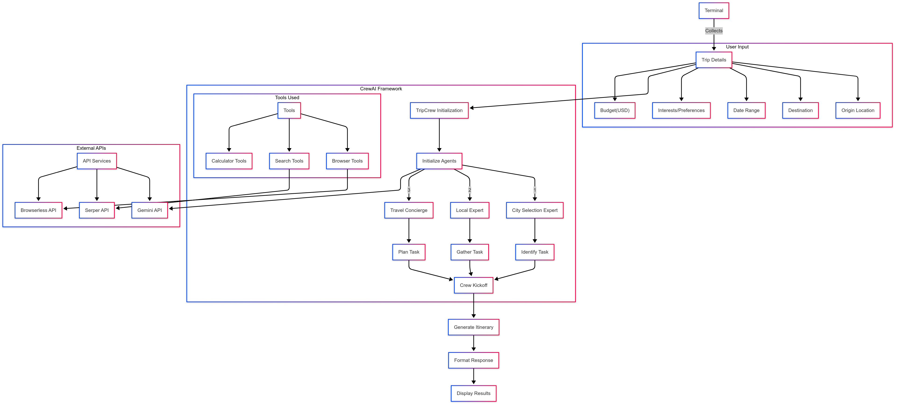

# Travel Planning System

Developed an AI-powered Trip Planning System using the CrewAI framework to generate personalized travel itineraries based on user-defined criteria. The system orchestrates a team of specialized agents and leverages custom tools to provide comprehensive and insightful travel planning assistance.

## System Architecture




The system architecture employs a multi-agent approach that collaborate to gather information, make decisions, and create detailed itineraries.

## Key Features:
*   **Intelligent Itinerary Generation:** Accepts user-defined start and end dates, locations, budget, and preferences to create comprehensive travel plans.
*   **Multi-Agent Architecture:** Employs a City Selection Agent, Local Expert Agent, and Travel Concierge Agent to optimize various aspects of trip planning.
*   **Custom Tool Integration:** Leverages a Browser Tool (for website content summarization), a Calculator Tool (for budget management), and a Search Tool (powered by Serper API) to gather and process travel-related information.
*   **Entity Memory:** Implemented entity memory using a RAG-based approach to capture and organize information about key entities (e.g., places, concepts) encountered during task execution, empowering agent's ability to remember and learn from interactions.
*   **Detailed Logging and Monitoring:** Utilized output log files and verbose logging to track agent actions, tool usage, and errors, facilitating debugging and performance analysis.
*   **Modularity:** Organized code into modular components for maintainability and scalability.

## Agents

*   **City Selection Agent:** Selects city from destinations given based on user preferences.
*   **Local Expert:** Provides curated insights and deep recommendations, acting as a virtual local guide about the chosen city
*   **Travel Concierge:** Creates comprehensive travel itineraries by considering the preferences given by user within the specified budget.

## Custom Tools

*   **Browser Tool:** Used to scrape and summarize website content, focusing on accuracy through page-by-page extraction.
*   **Calculator Tool:** Performs basic calculations for budget management.
*   **Search Tool:** Leverages the Serper API for comprehensive browser-based search.

## Entity Memory

Implemented short-term entity memory with Retrieval-Augmented Generation (RAG) to enhance understanding and enable contextual retrieval of information related to key entities.

## Logging and Monitoring

Utilized output log files and verbose logging to track agent actions, tool usage, and errors, facilitating debugging and performance analysis.

## Components:

*   `trip_tasks.py`: Contains task prompts for the agents.
*   `trip_agents.py`: Manages the creation of agents.
*   `/tools directory`: contains tool classes used by agents.
*   `/memory`: folder to store the information about key entities from interaction as a memory.

## Future Extension:

1. Validating the itinerary budget, by comparing the generated budget from itenary task to the total budget given by the user,  with the help of Guardrail, which send back the error to the agent before going to next agent and asks to generate itenary again for the specified number of maximum retries.
2. Storing the past execution output as a long-term memory which can be queryed using SQL query(sqlite3) for future reference like the  entry ticket price of different places. It is also important to periodically reset the memory to avoid memory overflow.
3. In the city selection agent, adding one more custom tool to check budget against the basic expenses in potential destination cities.
4. Try to integarte the actual website API, instead of scraping the website.

## Running the Project:

1.  Clone the repo and navigate to project directory.
2.  Create a virtual environment and activate it.
3.  Install the dependencies using: `pip install -r requirements.txt`
4.  In the `.env` file, add your API keys for LLM, Serper, and Browserless, and set the memory storage folder path accordingly.
5.  Run the application using the following CLI command:

    ```
    python3 cli_app.py -o "Stockholm, Sweden" -d "Italy" -s 2025-05-01 -e 2025-05-5 -i "2 adults who love swimming, dancing, hiking, shopping, food, water sports adventures, rock climbing" -b 4000
    ```

    Where:
    *   `-o`: Origin location
    *   `-d`: Destination location
    *   `-s`: Starting date
    *   `-e`: End date
    *   `-i`: User preferences
    *   `-b`: Budget in USD
